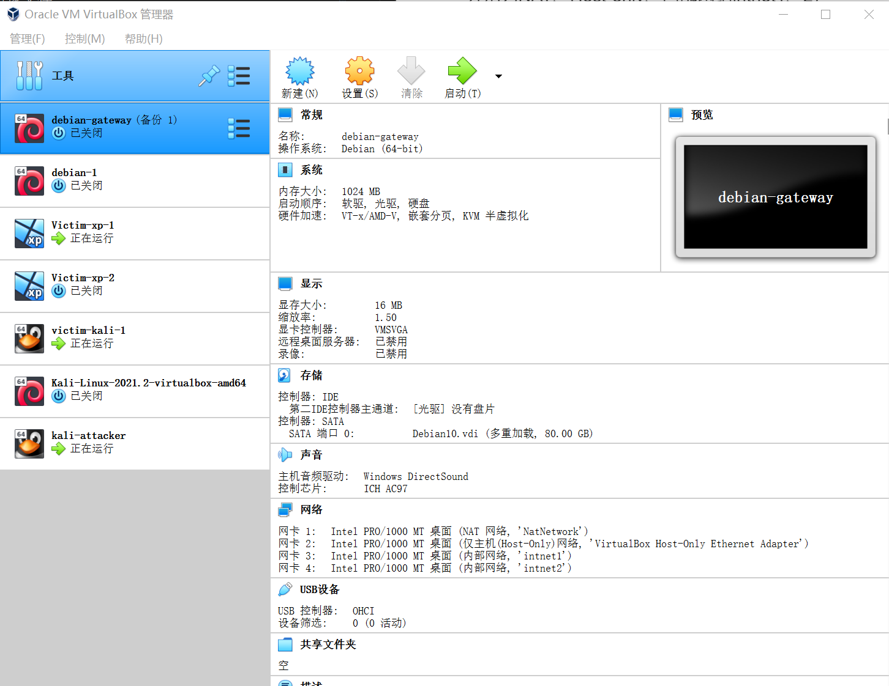
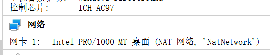

# 基于 VirtualBox 的网络攻防基础环境搭建

## 实验目的
* 掌握 VirtualBox 虚拟机的安装与使用
* 掌握 VirtualBox 的虚拟网络类型和按需配置
* 掌握 VirtualBox 的虚拟硬盘多重加载

## 实验环境
以下是本次实验需要使用的网络节点说明和主要软件举例：
* VirtualBox 虚拟机
* 攻击者主机（Attacker）：Kali Rolling 
* 网关（Gateway, GW）：Debian Buster
* 靶机（Victim）：xp-sp3 / Kali

## 实验过程

### 实验步骤

1. 环境安装

* 安装Virtualbox

* 下载虚拟机所需要的镜像文件
  * kali: kali-linux-2021.2-virtualbox-amd64.ova
  * debian:Debian10.vdi
  * windows xp:xp_sp3_base.vdi

* 用多重加载方式安装虚拟机

  * 新建虚拟电脑kali-attacker(直接导入ova文件)
  * 安装完成后，进行多重加载操作，管理-虚拟介质管理-将虚拟盘进行释放，将虚拟硬盘改成多重加载模式

  * 新建虚拟机victim-kali-1(直接使用已有的多重加载虚拟硬盘文件)

2. 安装各个虚拟机

* kali 使用上述步骤进行安装

* debian根据教程视频进行安装，并进行网关配置，如下图(四块网卡分别为NAT、Host-only、内部网络intnet1、2)

  * 注：与教程视频中步骤不同，查看ip地址时网卡也已经分配了地址，不需要更改文件及配置
  

* xp(靶机) 直接用vdi文件进行安装进行配置(注意默认32bit)
  * 注：需要将网络-控制芯片更改为：`PCnet-FAST III`
  

* 设置攻击者主机
  

* 安装的所有虚拟机如下图


3. 各虚拟机ip地址
* 网关(debian-gateway) 

|  网卡   |        ip address      |
|  ----   |         ----           |
| 网卡2   |    192.168.56.113/24   |
| 网卡3   |    172.16.111.1/24     |
| 网卡4   |    172.16.222.1/24     |

* 靶机

|  类型    |        名称     |     网络   |   ip地址        |
|  ----    |         ----   |   ---      |    ---         |
| kali     |  Victim-kali-1 |   intnet1  | 172.16.111.132 | 
| debian   |  debian-1      |   intnet2  | 172.16.222.115 |
| xp-sp3   |  Victim-xp-1   |   intnet1  | 172.16.111.101 |
| xp-sp3   |  Victim-xp-2   |   intnet2  | 172.16.222.128 |

* 攻击者
  名称：kali-attacker
  IP地址：10.0.2.4

1. 完成以下网络连通性测试
- [x] 靶机可以直接访问攻击者主机


- [x] 攻击者主机无法直接访问靶机


- [x] 网关可以直接访问攻击者主机和靶机


- [x] 靶机的所有对外上下行流量必须经过网关

```
apt update && apt install tmux  # 安装tmux
apt install tcpdump # 安装tcpdump
tcpdump -i enp0s9 -n -w 20210911.1.pcap # 对intnet1内部网络的xp靶机进行抓包
```


- [x] 所有节点均可以访问互联网


## 实验问题

1. debian虚拟机无法启用ssh

* 解决方法：
  * 修改配置文件 `vi /etc/ssh/sshd_config`
  * 将`PermitRootLogin prohibit-password`修改为`PermitRootLogin yes`
    
  * 重启ssh服务 `/etc/init.d/ssh restart`
  * 连接成功
    

## 参考资料
- [B站教学视频](https://www.bilibili.com/video/BV1CL41147vX?p=12&spm_id_from=333.1007.top_right_bar_window_history.content.click)

- [网络安全在线课本](https://c4pr1c3.github.io/cuc-ns/) 

- [徐泽林的ssh连接问题解决方案](https://github.com/CUCCS/2021-ns-public-EddieXu1125/tree/chap0x01/chap0x01)