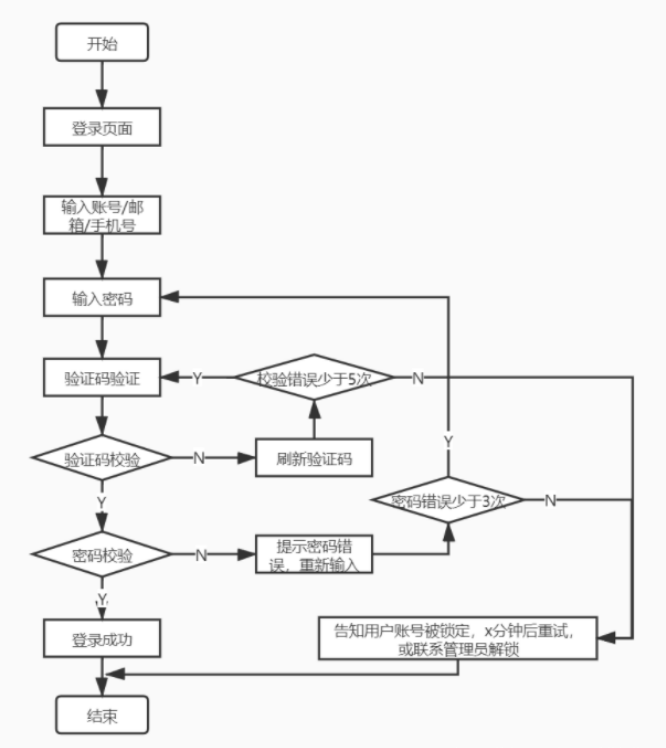
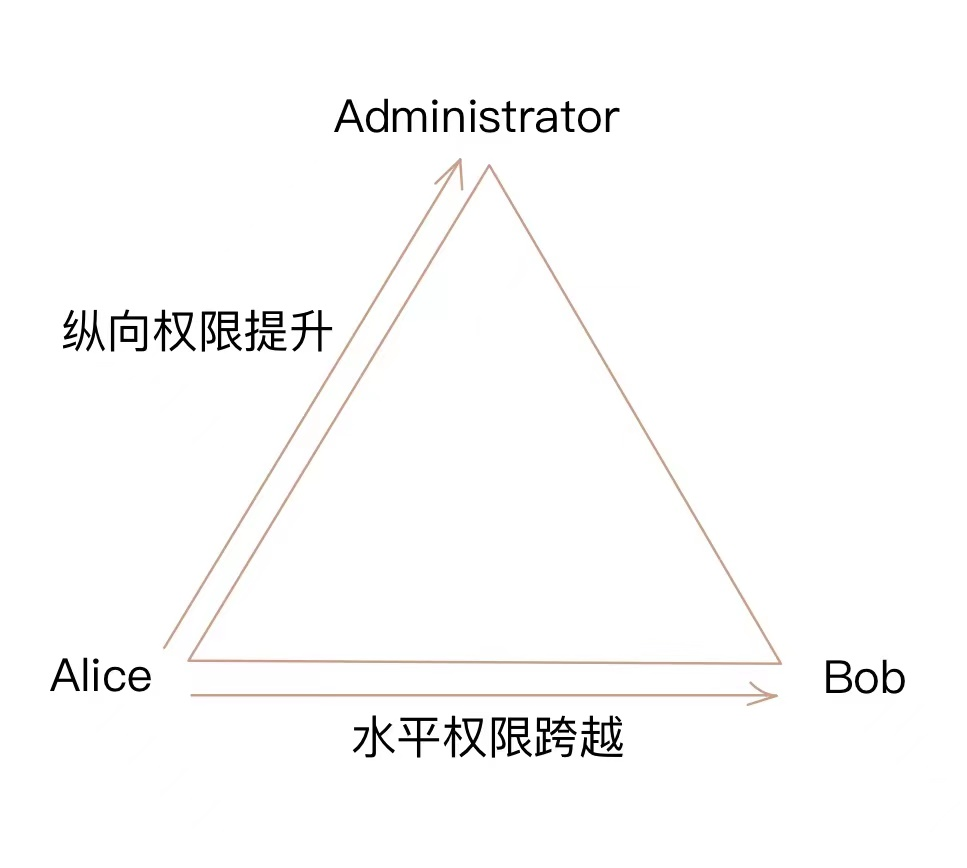

# 操作系统的访问控制设计实例研究

## 实验环境
* 操作系统版本：11.0.0
* 版本号：11.0.0.155(C00E155R2P5) GPU Turbo
* 硬件设备型号：ELE-AL00 (HUAWEI P30)
* 是否默认设置：是

## 实验过程(以Android系统为研究对象)

* 当系统处于锁屏状态下接收到新短信时，不解锁情况下:
  * 系统是否允许查看短信内容？  **是**
  * 系统是否允许回复短信？  **否**
  * 安卓上的 App : 以 微信电话本 为例，在接管了系统短信功能和权限之后，是否会有一些不同的功能设定？  **无微信电话本**
* 当系统处于锁屏状态下，使用系统内置（例如 iOS 的 Siri ）或第三方的语音助手可以完成以下哪些操作？
  * 访问通讯录   **不能**
  * 拨打电话    **能**
  * 访问相册    **不能**
  * 查看短信收件箱    **不能**
* 实验并分析指纹识别相比较于简单密码、复杂密码、图形解锁、人脸识别解锁、声纹解锁等解锁方式的安全性、便利性差异。
  * 安全性
    * 简单密码：安全性小于指纹解锁，简单密码可以被分析破解或者统计破解，被暴力破解的可能性较大
    * 复杂密码：安全性高于简单密码
    * 图形解锁：简单的图形密码有可能被穷举分析，并且图形密码和简单密码容易被偷窥破解，指纹则不存在此种攻击方式
    * 人脸识别解锁：人脸识别主要是特征识别，且准确率收到许多外部因素的影响，比如人脸的变化和照片的质量问题，安全性在特征唯一的情况下可以保证，但是Android有时的人脸识别会出现问题
    * 声纹解锁：与人脸识别相似，有一定的安全性，但容易被外界的环境因素影响，比如感冒的声音变化，但是可以通过伪造声音进行解锁
    * 指纹解锁：指纹不容易出现重复，且每个人的指纹唯一，如果要破解需要复制指纹，但是需要一定的技术手段，因此安全性较好
  * 便利性
    * 指纹解锁是一种十分便利的解锁方式，因为简单密码需要通过按键输入，图形密码需要在屏幕上滑动，人脸识别需要摄像头、灯光、无面部遮挡等条件，声纹识别需要一定安静程度的环境，指纹解锁只需要传感器
    * 然而，如果在手指潮湿，受伤(指纹有所破坏)，传感器上有污物的时候，指纹解锁也无法生效，此时，传统的密码解锁和人脸识别可以成为备用方案

## 思考题

* 以上设计实现方式属于我们课堂上讲过的哪种强制访问控制模型？Lattice/BLP？Biba？
  * **BLP模型**,对于刚接手的短信，所有客人用户(低安全等级)都可以对其进行查看，属于下读行为；可以回复短信，属于上写行为。
* 系统或第三方应用程序是否提供了上述功能的访问控制规则修改？如果修改默认配置，是提高了安全性还是降低了安全性？
实验注意事项：
  * **是**，但是第三方应用程序对安全性的影响依赖于用户的设置，如果设置不当，安全性就会降低

## 课后习题
1. 生物特征身份认证方式有哪些？优缺点分析？应用场景举例。
```
- 指纹识别:
  - 优点：
    识别速度快、应用方便、适应能力强，推广容易、误判率和拒真率低，易操作、个体独特性、采集相对容易、进行身份认证时方便快捷
  - 缺点：
  1.对环境的要求很高，对手指的湿度、清洁度等都很敏感，脏、油、水都会造成识别不了或影响到识别的结果
  2.某些人或某些群体的指纹特征少，甚至无指纹，所以难以成像
  3.对于脱皮、有伤痕等低质量指纹存在识别困难、识别率低的问题,对于一些手上老茧较多的体力劳动者等部分特殊人群的注册和识别困难较大
  4.每一次使用指纹时都会在指纹采集头上留下用户的指纹印痕，而这些指纹痕迹存在被用来复制指纹的可能性
  5.指纹识别时的操作规范要求较高
  - 举例：智能门锁、指纹考勤、智能柜、一体机、保险柜、电脑登陆、指纹数据库、银行借贷
- 虹膜识别：
  - 优点：
  1.所有生物识别都具有的优点，身体本身的功能器官，不会像密码一样有忘记的属性
  2.和面部识别一样，非接触性，使用者不需要和设备直接接触就获取了图像，干净卫生，避免了疾病的可能的接触传染
  3.和指纹及面部容易修改和磨损不同，虹膜在眼睛内部，基本不可能被复制修改
  - 缺点：
  1.硬件设备小型化不容易，智能手机已经是非常小的设备
  2.相较于其它生物识别硬件，虹膜识别硬件造价较高，大范围推广困难
  3.使用便捷性较差，识别准度略低，反应速度较慢
  - 举例：工作人员安检、矿山人员安全管理、建筑实名制认证、教育考试、司法安检、银行金融、门禁考勤
- 面部识别：
  - 优点：
  1.非接触性，相比较其他生物识别技术而言，人脸识别是非接触的，用户不需要和设备直接接触
  2.并发性，在实际应用场景中，人脸识别技术可以进行多个人脸的分拣、判断及识别
  3.非强制性，被识别的人脸图像信息可以主动获取而不被被测个体察觉
  4.自然性，所谓的自然性是指通过观察比较人脸来区分和确认身份;具有自然性的识别还有语音识别和体形识别
  - 缺点：
  1.人类脸部存在相似性，不同个体之间的区别不大，所有的人脸的结构都相似，甚至人脸器官的结构外形都很相似。这样的特点对于利用人脸进行定位是有利的，但是对于利用人脸区分人类个体是不利的。在加上化妆的掩盖及双胞胎的天然相似性更增加了识别的难度
  2.人脸存在易变性，人脸的外形很不稳定，人可以通过脸部的变化产生很多表情，而在不同观察角度，人脸的视觉图像也相差很大。
  - 举例：考勤系统、照片检索、天眼系统、门禁系统
- 声纹识别：
  - 优点：
  1.蕴含声纹特征的语音获取方便、自然，声纹提取可在不知不觉中完成，因此使用者的接受程度也高
  2.获取语音的识别成本低廉，使用简单，一个麦克风即可，在使用通讯设备时更无需额外的录音设备
  3.适合远程身份确认，只需要一个麦克风或电话、手机就可以通过网路(通讯网络或互联网络)实现远程登录
  4.声纹辨认和确认的算法复杂度低
  5.配合一些其他措施，如通过语音识别进行内容鉴别等，可以提高准确率；
  - 缺点：
  1.同一个人的声音具有易变性，易受身体状况、年龄、情绪等的影响
  2.不同的麦克风和信道对识别性能有影响
  3.环境噪音对识别有干扰
  4.混合说话人的情形下人的声纹特征不易提取
  - 举例：智能音响、智能家具
```
2. “找回口令功能”和“忘记密码”在访问授权机制中的意义？请尝试设计几种安全的“找回口令功能”，详细描述找回口令的用户具体操作过程。
   
- 意义：只有通过身份认证后用户才能获得相应的权限，如果用户忘记了密码(无法通过认证)，就无法获得原先已有的权限；密码重置是通过给用户的邮箱发送具有时效性的带有特殊标识的链接，或是给用户手机发送有时效性的验证码，完成密码重置
  
- 方案设计：重置密码时用手机短信码确认身份，再发送重置链接到用户邮箱；从邮箱点击重置链接后，确认身份，允许更改密码，并且要回答一个初始设置的安全问题；用户回答问题，并发送验证码至自己的邮箱，完成身份认证后再进行下一步的重置操作
  
3. 绘制用户使用用户名/口令+图片验证码方式录系统的流程图。考虑认证成功和失败两种场景，考虑授权成功和失败两种场景。

   
4. Windows XP / 7 中的访问控制策略有哪些？访问控制机制有哪些？
- 访问控制策略：
自主访问控制：(DAC，Discretionary Access Control)的特点是根据主体的身份及允许访问的权限进行决策。所谓自主是指具有某种访问能力的主体能够自主地将访问权的某个子集授予其他主体
强制访问控制：(MAC，Mandatory Access Control)取决于能用算法表达的并能在计算机上执行的策略，通常强制访问控制的实现都是内置在操作系统源代码里的算法实现，在系统发布部署后无法被修改
基于角色的访问控制：(RAC，Role-Based Access Control)是基于角色的访问控制是一个复合的规则。一个身份被分配给一个被授权的组。每个角色与一组用户和有关的动作相互关联，角色中所属的用户可以有权执行这些操作。角色与组的区别是：组只是一组用户的集合，而角色则是一组用户的集合加上一组操作权限的集合

- 访问控制机制：
  - 访问令牌 (access token)
  - 安全描述符 (security descriptors)
    - 安全标识(security identifiers, SID)
    - 访问控制列表(access control list, ACL)
      - 自主访问控制列表(discretionary access control list, DACL)
      - 系统访问控制列表(system access control list, SACL)

5. 用权限三角形模型来理解并描述下2种威胁模型：提权、仿冒。

- 提权：提权就是通过各种办法和漏洞，提高自己在服务器中的权限，以便控制全局
  - 水平权限提升：指相同权限下不同的用户可以互相访问
  - 纵向权限提升：指使用权限低的用户可以访问到权限较高的用户
  - eg：一个论坛网站有两个普通用户A和B，还有一个管理员C，A获得了删除B帖子的权限就是水平越权；A获得了删除C帖子的权限就是垂直越权
- 仿冒：A以B的身份进行认证，拥有B的权利,角色进行了变更，权利发生了变化

6. 试通过操作系统的访问控制机制来达到预防一种真实病毒的运行目的。
熊猫烧香是一种感染性病毒、蠕虫病毒，其病毒行为为修改 PE 文件，设置文件夹属性，杀掉杀毒软件进程，关闭系统和杀毒软件服务，设置文件属性，在根目录创建自运行文件，修改注册表，修改启动项等，可以通过修改组策略防止蠕虫病毒，如：添加注册表自启动、定时关闭防火墙和删除文件等来限制系统服务的运行
   
7. 什么是 OAuth？
OAuth的全称是Open Authorization，是一个开放授权协议，它制定了一些标准，可以使得第三方应用无需使用用户名密码即可获得用户资源。目前很多应用都提供了第三方社交账号登录及绑定，而这背后使用的技术就是Oauth2.0.常见的授权方式是使用授权码。

允许用户提供一个令牌，而不是用户名和密码来访问他们存放在特定服务提供者的数据。每一个令牌授权一个特定的网站在特定的时段内访问特定的资源。这样，OAuth允许用户授权第三方网站访问他们存储在另外的服务提供者上的信息，而不需要分享他们的访问许可或他们数据的所有内容。

8. 什么是 OpenID？
OpenID是一个以用户为中心的数字身份识别框架，它具有开放、分散、自由等特性。OpenID可以通过URI来认证一个网站的唯一身份，同理，我们也可以通过这种方式来作为用户的身份认证。 由于URI 是整个网络世界的核心，它为基于URI的用户身份认证提供了广泛的、坚实的基础。OpenID系统的第一部分是身份验证，即如何通过URI来认证用户身份。目前的网站都是依靠用户名和密码来登录认证，这就意味着大家在每个网站都需要注册用户名和密码，即便使用的是同样的密码

9. 试用本章所学理论分析OAuth和OpenID的区别与联系。
OAuth关注的是authorization；而OpenID侧重的是authentication。从表面上看，这两个英文单词很容易混淆，但实际上，它们的含义有本质的区别：OAuth关注的是授权，即：“用户能做什么”；而OpenID关注的是证明，即：“用户是谁”。

10. 如何使用 OAuth 和 OpenID 相关技术实现单点登录（Single Sign On）？
单点登录（Single Sign On），简称为SSO，是在多个应用系统中，用户只需要登录一次就可以访问所有相互信任的应用系统。用户通过客户端通过认证访问资源，返回此用户的专属openid,客户端进行保存，并在以后的访问中用此openid进行认证来获取资源
