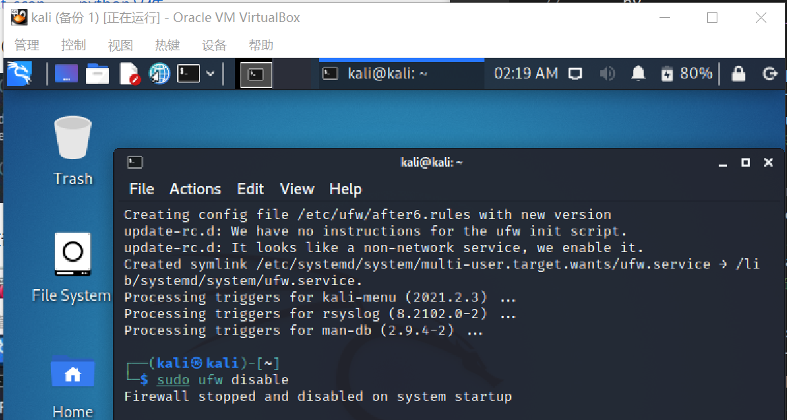
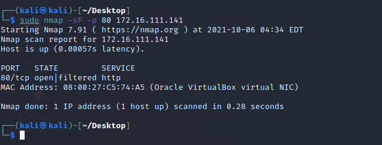
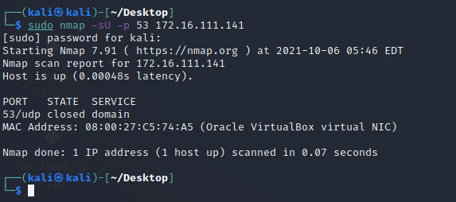

# 基于 Scapy 编写端口扫描器
## 实验目的
* 掌握网络扫描之端口状态探测的基本原理
## 实验环境
* python 3.9 + scapy
* 攻击者主机(Kali_Attacker) : Kali-Linux
* 靶机(Kali)：Kali-Linux
* 网关(Gateway): Debian 10
* 网络拓扑:


## 实验要求
- [x] 禁止探测互联网上的 IP ，严格遵守网络安全相关法律法规
* 完成以下扫描技术的编程实现
  - [x] TCP connect scan / TCP stealth scan
  - [x] TCP Xmas scan / TCP fin scan / TCP null scan
  - [x] UDP scan
- [x] 上述每种扫描技术的实现测试均需要测试端口状态为：开放、关闭 和 过滤 状态时的程序执行结果
- [x] 提供每一次扫描测试的抓包结果并分析与课本中的扫描方法原理是否相符？如果不同，试分析原因；
- [x] 在实验报告中详细说明实验网络环境拓扑、被测试 IP 的端口状态是如何模拟的
- [x] （可选）复刻 nmap 的上述扫描技术实现的命令行参数开关

## Scapy基础
```
# 导入模块
from scapy.all import *
# 查看包信息
pkt = IP(dst="")
ls(pkt)
pkt.show()
summary(pkt)
# 发送数据包
send(pkt)  # 发送第三层数据包，但不会受到返回的结果。
sr(pkt)  # 发送第三层数据包，返回两个结果，分别是接收到响应的数据包和未收到响应的数据包。
sr1(pkt)  # 发送第三层数据包，仅仅返回接收到响应的数据包。
sendp(pkt)  # 发送第二层数据包。
srp(pkt)  # 发送第二层数据包，并等待响应。
srp1(pkt)  # 发送第二层数据包，并返回响应的数据包
# 监听网卡
sniff(iface="wlan1",count=100,filter="tcp")
# 应用：简单的SYN端口扫描 （测试中）
pkt = IP("...")/TCP(dport=[n for n in range(22, 3389)], flags="S")
ans, uans = sr(pkt)
ans.summary() # flag为SA表示开放，RA表示关闭
```

## 实验过程
**端口状态模拟**
* 关闭状态：端口关闭监听，防火墙关闭
```
# 靶机安装ufw
apt-get install ufw
# 关闭防火墙
ufw disable
# 关闭特定端口
systemctl stop apache2
systemctl stop dnsmasq
```
* 开启状态：端口开启监听，防火墙关闭
```
systemctl start apache2 # 开启80端口(apache2基于TCP)
systemctl start dnsmasq # 开启53端口(DNS服务基于UDP)
```
* 过滤状态：对应端口开启监听，防火墙开启
```
ufw enable # 开启防火墙
ufw enable && ufw deny 80/tcp #开启80端口监听
ufw enable && ufw deny 53/udp #开启53端口监听
```
* dnsmasq相关操作
```
sudo apt-get update
# 安装dnsmasq
sudo apt-get instal dnsmasq
# 启动
systemctl start dnsmasq
# 查看状态
systemctl status dnsmasq
# 关闭
systemctl stop dnsmasq
```
初始状态：


***TCP connect scan***
首先发送一个SYN数据包到目标主机的特定端口上，接着我们可以通过接收包的情况对端口的状态进行判断：如果接收到的是一个SYN/ACK数据包，则说明端口是开放状态的；如果接收到的是一个RST/ACK数据包，通常意味着端口是关闭的并且链接将会被重置；而如果目标主机没有任何响应则意味着目标主机的端口处于过滤状态。若接收到SYN/ACK数据包(即检测到端口是开启的)，便发送一个ACK确认包到目标主机，这样便完成了三次握手连接机制。

**Code**
```py
from scapy.all import *

def tcpconnect(dst_ip, dst_port, timeout=10):
    pkts = sr1(IP(dst=dst_ip)/TCP(dport=dst_port,flags="S"),timeout=timeout)
    # 无响应意味着目标主机的端口处于过滤状态
    if pkts is None:
        print("Filtered")
    elif(pkts.haslayer(TCP)):
        # 0x012:(SYN,ACK)包证明端口开放
        if(pkts.getlayer(TCP).flags == 0x12):
            #发送ACK确认包
            send_rst = sr(IP(dst=dst_ip)/TCP(dport=dst_port,flags="AR"),timeout=timeout)
            print("Open")
        # 0x014:(RST,ACK)包证明端口关闭
        elif (pkts.getlayer(TCP).flags == 0x14):   
            print("Closed")

# 连接靶机
tcpconnect('172.16.111.141', 80)
```  

* Closed(在靶机执行```sudo ufw disable```使其处于关闭状态)

  * 攻击者主机执行代码(将.py文件拖到虚拟机：设备——共享粘贴板——双向；拖放——双向)
  
  * 靶机抓包(先抓包，再运行py文件，保证抓到整个过程的包)
  ```
  # 抓包命令
  sudo tcpdump -i eth0 -enp -w catch_from_eth0.pcap
  ```
  * 打开文件 catch_from_eth0.pcap
  
  * nmap复刻：
  ```nmap -sT -p 80 172.16.111.141```
  

* Open

  * 攻击者主机执行代码  
  
  * 靶机抓包
  
  * 打开文件
  
  * nmap复刻  
  

* Filtered  

  * 靶机抓包：  
  
  * 攻击者主机执行代码：  
  
  * 打开文件：  
  
  * nmap复刻  
  

***TCP stealth scan***
发送一个SYN包启动三方握手链接机制，并等待响应。如果接收到一个SYN/ACK包表示目标端口是开放的；如果接收到一个RST/ACK包表明目标端口是关闭的；如果端口是被过滤的状态则没有响应。当得到的是一个SYN/ACK包时通过发送一个RST包立即拆除连接。
**Code**
```py
from scapy.all import *


def tcpstealthscan(dst_ip, dst_port, timeout=10):
    pkts = sr1(IP(dst=dst_ip)/TCP(dport=dst_port, flags="S"), timeout=10)
    # 无响应意味着目标主机的端口处于过滤状态
    if (pkts is None): 
        print("Filtered")
    elif(pkts.haslayer(TCP)):
        # 0x012:(SYN,ACK)包证明端口开放
        if(pkts.getlayer(TCP).flags == 0x12):
            send_rst = sr(IP(dst=dst_ip) /
                          TCP(dport=dst_port, flags="R"), timeout=10)
            print("Open")
        # 0x014:(RST,ACK)包证明端口关闭
        elif (pkts.getlayer(TCP).flags == 0x14):
            print("Closed")
        # 两种不可达情况
        elif(pkts.haslayer(ICMP)):
            if(int(pkts.getlayer(ICMP).type) == 3 and int(stealth_scan_resp.getlayer(ICMP).code) in [1, 2, 3, 9, 10, 13]):
                print("Filtered")

# 连接靶机
tcpstealthscan('172.16.111.141', 80)
```
* Closed  

  * 靶机抓包：  
  
  * 攻击者主机执行代码：  
  
  * 打开文件：  
  
  * nmap复刻：  
  ```sudo nmap -sS -p 80 172.16.111.141```
  

* Open(重复上述步骤)

  * 靶机抓包   
  * 攻击者主机执行代码
  * 打开文件：  
  
  * nmap复刻：  
  

* Filtered  

  * 靶机抓包  
  * 攻击者主机执行代码
  * 打开文件：  
  
  * nmap复刻：  
  

***TCP Xmas scan***
Xmas发送一个TCP包，并对TCP报文头 FIN、URG 和 PUSH 标记进行设置。若是关闭的端口则响应 RST 报文；开放或过滤状态下的端口则无任何响应

**Code**
```py
from scapy.all import *


def Xmasscan(dst_ip, dst_port, timeout=10):
    pkts = sr1(IP(dst=dst_ip)/TCP(dport=dst_port, flags="FPU"), timeout=10)
    if (pkts is None):
        print("Open|Filtered")
    # 0x014:(RST,ACK)包证明端口关闭
    elif(pkts.haslayer(TCP)):
        if(pkts.getlayer(TCP).flags == 0x14):
            print("Closed")
    elif(pkts.haslayer(ICMP)):
        if(int(pkts.getlayer(ICMP).type) == 3 and int(pkts.getlayer(ICMP).code) in [1, 2, 3, 9, 10, 13]):
            print("Filtered")


Xmasscan('172.16.111.141', 80)
```

* Closed  

  * 靶机抓包：  
  
  * 攻击者主机执行代码：  
  
  * 打开文件：  
  
  * nmap复刻：  
  ```sudo nmap -sX -p 80 172.16.111.141```  
  

* Open(与上述步骤重复，只展示pcap文件和nmap截图)  

  * 靶机抓包：  
  * 攻击者主机执行代码：
  * 打开文件：  
  
  * nmap复刻：  
  

* Filtered  

  * 靶机抓包：  
  * 攻击者主机执行代码：
  * 打开文件：  
  
  * nmap复刻：  
  


***TCP fin scan***
仅发送FIN包，它可以直接通过防火墙，如果端口是关闭的就会回复一个RST包，如果端口是开放或过滤状态则对 FIN 包没有任何响应。

**Code**
```py
from scapy.all import *


def finscan(dst_ip, dst_port, timeout=10):
    pkts = sr1(IP(dst=dst_ip)/TCP(dport=dst_port, flags="F"), timeout=10)
    if (pkts is None):
        print("Open|Filtered")
    # 0x014:(RST,ACK)包证明端口关闭
    elif(pkts.haslayer(TCP)):
        if(pkts.getlayer(TCP).flags == 0x14):
            print("Closed")
    elif(pkts.haslayer(ICMP)):
        if(int(pkts.getlayer(ICMP).type) == 3 and int(pkts.getlayer(ICMP).code) in [1, 2, 3, 9, 10, 13]):
            print("Filtered")


finscan('172.16.111.141', 80)
```
* Closed  

  * 靶机抓包：  
  
  * 攻击者主机执行代码：  
  
  * 打开文件：  
  
  * nmap复刻：  
  ```sudo nmap -sF -p 80 172.16.111.141```  
  

* Open

  * 靶机抓包：  
  * 攻击者主机执行代码：  
  * 打开文件：  
  
  * nmap复刻：  
  

* Filtered  

  * 靶机抓包：  
  * 攻击者主机执行代码：  
  * 打开文件：  
  
  * nmap复刻：  
  

***TCP null scan***
发送一个 TCP 数据包，关闭所有 TCP 报文头标记。只有关闭的端口会发送 RST 响应。

**Code**
```py
from scapy.all import *


def nullscan(dst_ip, dst_port, timeout=10):
    pkts = sr1(IP(dst=dst_ip)/TCP(dport=dst_port, flags=""), timeout=10)
    if (pkts is None):
        print("Open|Filtered")
    elif(pkts.haslayer(TCP)):
        if(pkts.getlayer(TCP).flags == 0x14):
            print("Closed")
    elif(pkts.haslayer(ICMP)):
        if(int(pkts.getlayer(ICMP).type) == 3 and int(pkts.getlayer(ICMP).code) in [1, 2, 3, 9, 10, 13]):
            print("Filtered")


nullscan('172.16.111.141', 80)
```

* Closed
  * 靶机抓包：
  * 攻击者主机执行代码：
  * 打开文件：  
  
  * nmap复刻：  
  
* Open
  * 靶机抓包：
  * 攻击者主机执行代码：
  * 打开文件：  
  
  * nmap复刻：  
  
* Filtered
  * 靶机抓包：
  * 攻击者主机执行代码：
  * 打开文件：  
  
  * nmap复刻：  
  ```sudo nmap -sN -p 80 172.16.111.141```  
  

***UDP scan***
多数 UDP 端口扫描的方法就是向各个被扫描的 UDP 端口发送零字节的 UDP 数据包，如果收到一个 ICMP 不可到达的回应，那么则认为这个端口是关闭的,对于没有回应的端口则认为是开放的，但是如果目标主机安装有防火墙或其它可以过滤数据包的软硬件,那我们发出 UDP 数据包后,将可能得不到任何回应,我们将会见到所有的被扫描端口都是开放的
**Code**
```py
from scapy.all import *


def udpscan(dst_ip, dst_port, dst_timeout=10):
    resp = sr1(IP(dst=dst_ip)/UDP(dport=dst_port), timeout=dst_timeout)
    if (resp is None):
        print("Open|Filtered")
    elif (resp.haslayer(UDP)):
        print("Open")
    elif(resp.haslayer(ICMP)):
        if(int(resp.getlayer(ICMP).type) == 3 and int(resp.getlayer(ICMP).code) == 3):
            print("Closed")
        elif(int(resp.getlayer(ICMP).type) == 3 and int(resp.getlayer(ICMP).code) in [1, 2, 9, 10, 13]):
            print("Filtered")
        elif(resp.haslayer(IP) and resp.getlayer(IP).proto == IP_PROTOS.udp):
            print("Open")


udpscan('172.16.111.141', 53)
```
* Closed  

  * 靶机抓包：
  * 攻击者主机执行代码：
  * 打开文件：  
  
  * nmap复刻：
  ```sudo nmap -sU -p 80 172.16.111.141```    
  


* Open
  * 靶机抓包：
  * 攻击者主机执行代码：
  * 打开文件：  
  
  * nmap复刻：  
  


* Filtered  

  * 靶机抓包：
  * 攻击者主机执行代码：
  * 打开文件：  
  
  * nmap复刻：  
  

## 参考资料
* [2020-ns-public-LyuLumos](https://github.com/CUCCS/2020-ns-public-LyuLumos/tree/ch0x05)
* [scapy官方文档](https://scapy.readthedocs.io/en/latest/)
* [课件](https://c4pr1c3.github.io/cuc-ns/chap0x05/main.html)